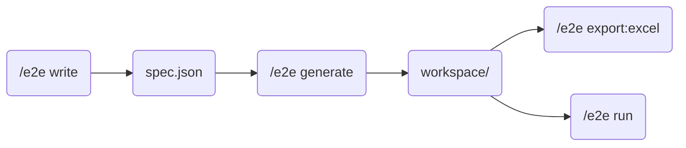

# E2E テスト（試験項目書作成・実行）

## 概要

E2E テストの試験項目書作成・実行を統合したスキル。

playwright-cli を活用したブラウザ自動化により、Web アプリケーションの動作確認を行う。

## サブコマンド

`$ARGS` をサブコマンドとして解析する。

```bash
/e2e write [overview]                    # 試験項目書作成（lint を含む）
/e2e generate --spec <path> [options]    # ワークスペース生成（前処理）
/e2e export:excel --workspace <path>     # Excel 試験項目書出力
/e2e run --workspace <path> [options]    # テスト実行（playwright-cli）
```

必須引数は generate が `--spec`、export:excel と run が `--workspace`。欠落している場合はサブエージェントへ委譲せず、その場でユーザに確認する（パスを推測して実行しない）。確認時は前提の一言（export:excel と run は generate 済みワークスペースが対象）を添えてよく、そのために references の前提条件節を参照してよい。値を受領したら通常フロー（サブエージェントへの委譲）に合流する。

### 実行フロー



## write: 試験項目書作成

詳細は [references/write.md](references/write.md) を参照。

## generate: ワークスペース生成

`Task` ツール（`subagent_type: general-purpose`, `run_in_background: false`）でサブエージェントを起動し、[references/generate.md](references/generate.md) の手順に従って実行させる。引数（`$ARGS`）と作業ディレクトリ（`pwd`）をプロンプトに含める。完了後、生成物一覧をユーザーに報告する。

## export:excel: Excel 試験項目書出力

`Task` ツール（`subagent_type: general-purpose`, `run_in_background: false`）でサブエージェントを起動し、[references/export-excel.md](references/export-excel.md) の手順に従って実行させる。引数（`$ARGS`）と作業ディレクトリ（`pwd`）をプロンプトに含める。完了後、出力ファイルパスをユーザーに報告する。

## run: テスト実行（playwright-cli）

`Task` ツール（`subagent_type: general-purpose`, `run_in_background: false`）でサブエージェントを起動し、[references/run.md](references/run.md) の手順に従って実行させる。引数（`$ARGS`）と作業ディレクトリ（`pwd`）をプロンプトに含める。完了後、`result.md` を Read してユーザーにサマリを報告する。

## E2E テスト規約

- テストデータのセットアップ・クリーンアップを各テスト内で行う
- API のモックは使わない。実際の API（テスト環境）に接続する
- **MUST: テスト実行前に問題（未解決の環境変数など）が検出された場合は、その時点でテストを中断しユーザーに通知すること。問題がある状態でテストを継続しない。**
